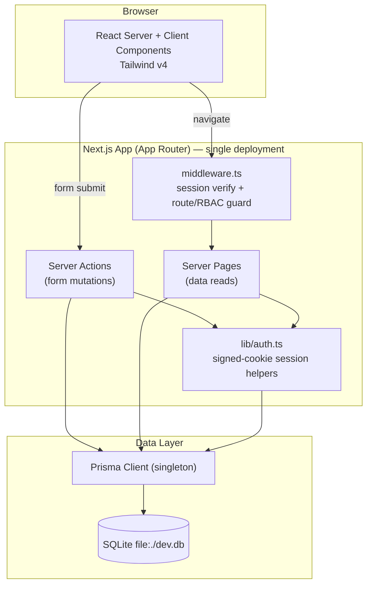
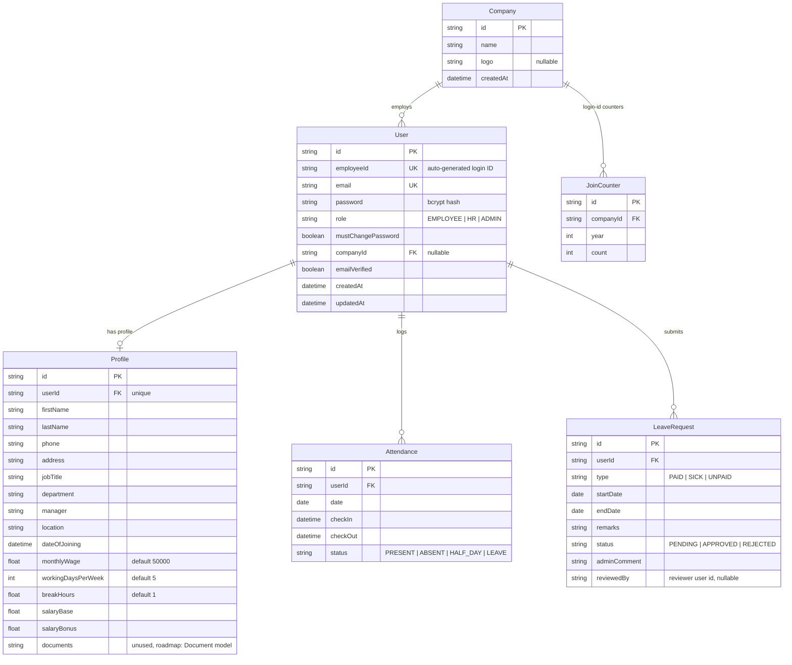

# Dayflow — Human Resource Management System

> _Every workday, perfectly aligned._

Dayflow is a **multi-tenant, role-based Human Resource Management System (HRMS)** that
digitizes core HR operations: company onboarding, employee management, attendance tracking,
leave / time-off approval workflows, and payroll visibility.

The tenant model is company-based: **signing up creates a new `Company` and you become its
Admin**. Admins then create Employee accounts — each gets an auto-generated Login ID
(per-company join counter + year) and a temporary password that must be changed on first
login (`mustChangePassword`). All data is scoped by `companyId`; companies are fully
isolated from each other at both the query level and in Server Actions.

This repository is a **full-stack Next.js** application backed by **SQLite** via **Prisma**,
with authentication handled by a **custom HMAC-signed cookie session** (no NextAuth/Auth.js).

---

## Table of Contents

1. [Project Overview](#1-project-overview)
2. [Tech Stack](#2-tech-stack)
3. [System Architecture](#3-system-architecture)
4. [Data Model (ERD)](#4-data-model-erd)
5. [Server Actions](#5-server-actions)
6. [Authentication, Sessions & RBAC](#6-authentication-sessions--rbac)
7. [Project Structure](#7-project-structure)
8. [Getting Started](#8-getting-started)
9. [Environment Variables](#9-environment-variables)
10. [Original 8-Hour MVP Plan (as originally planned)](#10-original-8-hour-mvp-plan-as-originally-planned)
11. [Non-Functional Requirements](#11-non-functional-requirements)
12. [Roadmap / Future Enhancements](#12-roadmap--future-enhancements)

---

## 1. Project Overview

### Scope (shipped MVP)

| Module | Employee | Admin / HR |
| --- | --- | --- |
| **Auth & RBAC** | Account created by Admin; login; forced temp-password change on first login | Company sign-up creates the company + admin account; login |
| **Employees** | — (view colleagues via `/employees/[id]`) | Create employees (auto Login ID + one-time temp password with copy affordance); full list scoped to own company |
| **Profile** | View all fields; edit phone/address | View & edit any employee's profile (own company only) |
| **Attendance** | Self check-in / check-out; view own records | View all company attendance (latest 100); mark attendance manually for any company employee |
| **Leave** | Apply (type, date range, remarks); track status | Review queue; approve / reject with comments |
| **Payroll** | Read-only salary breakdown | Set base salary + bonus per employee |

### Explicitly deferred (see [Roadmap](#12-roadmap--future-enhancements))

These are listed as _Future Enhancements_ in the spec and remain **out of scope**:

- Email verification on sign-up
- Email & notification alerts (leave approved/rejected)
- Analytics & reports dashboard (attendance trends, salary slip PDF export)
- Document upload/storage

### User classes & tenancy

- **Admin / HR Officer** — owns a `Company`; manages its employees, approves leave &
  attendance, edits payroll.
- **Employee** — belongs to exactly one `Company` (`User.companyId`); self-service only.
- Every admin read is filtered by `companyId` and every mutation verifies company ownership
  server-side. Cross-company IDOR attempts return 404 or `"Forbidden."`.

---

## 2. Tech Stack

| Layer | Choice | Why |
| --- | --- | --- |
| **Framework** | Next.js 16 (App Router) + React 19 + TypeScript | One codebase for UI + logic; Server Components for reads, Server Actions for writes |
| **Styling / UI** | Tailwind CSS v4 | Fast, consistent styling without a component-library dependency |
| **Auth** | Custom HMAC-SHA256 signed cookie session (`src/lib/auth.ts`, `src/lib/session.ts`) | Minimal, dependency-free; session payload embeds `id`, `email`, `role`, `companyId`, `mustChangePassword` |
| **Edge guard** | `src/middleware.ts` using Web Crypto verification of the same cookie | Route protection + RBAC before pages render |
| **ORM** | Prisma 6 | Type-safe schema, generated client, real migrations under `prisma/migrations/` |
| **Database** | SQLite (`prisma/dev.db`) | Zero-config local dev / hackathon demo. SQLite lacks Prisma enums, so roles/statuses are validated strings. For production/serverless deployment, switch the datasource to PostgreSQL/MySQL — the schema is portable |
| **Validation** | Zod | Runtime validation shared between forms and Server Actions |
| **Password hashing** | bcryptjs | Industry-standard salted hashing |

> **Note:** despite history, this project does **not** use NextAuth/Auth.js. The session env
> var was once named `NEXTAUTH_SECRET`; it is now `SESSION_SECRET` (the old name still works
> as a fallback).

---

## 3. System Architecture

Dayflow is a **modular monolith**: a single Next.js deployment that renders the UI, enforces
auth at the edge, and talks to SQLite through Prisma. Reads happen in **Server Components**;
all mutations go through **Server Actions** (`src/app/actions/*`). `src/middleware.ts`
guards routes and enforces roles before rendering.



### Layered responsibilities

- **Presentation** — App Router pages, layouts, components. Role-aware navigation.
- **Application** — Server Actions validate input (Zod), enforce RBAC + tenant ownership,
  then call Prisma directly (business rules are small enough to live inline).
- **Session/token layer** — `src/lib/session.ts` (pure Web Crypto, Edge-safe) shared by
  `src/lib/auth.ts` (server helpers) and `src/middleware.ts`.
- **Data access** — Prisma Client singleton (`src/lib/prisma.ts`).
- **Persistence** — SQLite file DB; schema owned by Prisma migrations.

---

## 4. Data Model (ERD)



### Key rules & constraints

- `User.employeeId` and `User.email` are **unique globally**; `employeeId` is generated as
  `<nameInitials><companyPrefix><year><serial>` via a per-company/year `JoinCounter` upsert.
- `Attendance` has a **composite unique** `(userId, date)` — one row per employee per day;
  check-in/out uses an upsert on it.
- `Profile.salaryBase` / `salaryBonus` hold payroll; derived breakdowns (basic/HRA/LTA/PF,
  professional tax) are computed on the fly in `src/lib/salary.ts` from `monthlyWage`.
- Deleting a `Company` cascades to its `JoinCounter`s; deleting a `User` cascades to their
  profile, attendance, and leave requests.
- SQLite doesn't support Prisma enums, so roles/statuses are plain strings validated in app
  code (see comments in `schema.prisma`).

The full, runnable schema lives in [`prisma/schema.prisma`](./prisma/schema.prisma).

---

## 5. Server Actions

There are no REST API routes — all mutations are React Server Actions in
`src/app/actions/`. Every action resolves the session itself and re-checks authorization +
company ownership (never trust the client).

| Action | File | Access | Purpose |
| --- | --- | --- | --- |
| `loginAction` | `actions/auth.ts` | Public | Sign in by email **or** Login ID; redirects to `/change-password` if flagged |
| `registerAction` | `actions/auth.ts` | Public | Creates a `Company` + its ADMIN user, signs in |
| `createEmployeeAction` | `actions/auth.ts` | Admin/HR | Creates an employee with auto Login ID + one-time temp password (returned once for display) |
| `changePasswordAction` | `actions/auth.ts` | Authenticated | Sets a new password, clears `mustChangePassword`, refreshes session |
| `logoutAction` | `actions/auth.ts` | Authenticated | Destroys session |
| `checkInAction` / `checkOutAction` | `actions/attendance.ts` | Authenticated (self) | Upsert today's attendance; computes HALF_DAY vs PRESENT on checkout |
| `markAttendanceAction` | `actions/attendance.ts` | Admin/HR | Manually set a company employee's status for a date |
| `applyLeaveAction` | `actions/leaves.ts` | Authenticated (self) | Create leave request; rejects overlapping PENDING/APPROVED ranges |
| `reviewLeaveAction` | `actions/leaves.ts` | Admin/HR | Approve/reject with comment; verifies target belongs to reviewer's company |
| `updateOwnProfileAction` | `actions/profile.ts` | Authenticated (self) | Edit phone/address |
| `adminUpdateProfileAction` | `actions/profile.ts` | Admin/HR | Edit job title/department/contact for a company employee |
| `updatePayrollAction` | `actions/profile.ts` | Admin/HR | Set base salary/bonus for a company employee |

---

## 6. Authentication, Sessions & RBAC

### Session format

A `dayflow_session` httpOnly cookie containing `base64url(payload).base64url(HMAC-SHA256)`,
where payload is `{ id, email, role, companyId, mustChangePassword, exp }`. Signing and
verification live in `src/lib/session.ts` (Web Crypto, no Node globals) so the exact same
code runs in the Node runtime (pages/actions) and the Edge runtime (middleware).

### Flow

1. **Register** → creates `Company` → ADMIN `User` (+ profile) → session cookie → `/dashboard`.
2. **Login** (email *or* auto-generated Login ID) → session cookie → `/dashboard`, or
   `/change-password` when `mustChangePassword` is set.
3. **Create employee** → admin sees the Login ID + temp password once (copy buttons +
   "shown only once" warning) → employee is forced through `/change-password` on first login.

### Defense-in-depth guards

- **Edge middleware (`src/middleware.ts`)**
  - Unauthenticated users hitting anything outside `/login`, `/register`,
    `/change-password` → `/login?next=…`
  - Signed-in users hitting `/login` or `/register` → `/dashboard`
  - `mustChangePassword === true` and path ≠ `/change-password` → `/change-password`
    (a fresh employee cannot bypass it by typing `/dashboard`)
  - Non-admins hitting `/admin/**` → `/dashboard`
- **Per-page checks** remain in every page/action as a second layer (the middleware is not
  a replacement).
- **Tenant isolation**: admin reads filter by `session.companyId`; mutations verify the
  target user/leave belongs to the same company before writing.

```
Public                 → /login, /register, /change-password
EMPLOYEE               → /dashboard, /profile, /attendance, /leaves, /payroll, /employees/[id]
ADMIN / HR             → everything above plus /admin/** (employees, attendance, leave approvals)
```

---

## 7. Project Structure

```
dayflow/
├─ prisma/
│  ├─ migrations/          # Prisma migration history (init + …)
│  ├─ schema.prisma        # Data model (source of truth)
│  ├─ seed.ts              # Seeds demo admin + employee
│  └─ dev.db               # Local SQLite file (gitignored)
├─ src/
│  ├─ app/
│  │  ├─ (auth)/
│  │  │  ├─ change-password/page.tsx
│  │  │  ├─ login/page.tsx
│  │  │  └─ register/page.tsx
│  │  ├─ (dashboard)/
│  │  │  ├─ layout.tsx            # Shell + header
│  │  │  ├─ dashboard/page.tsx    # Role-aware landing
│  │  │  ├─ profile/page.tsx
│  │  │  ├─ attendance/page.tsx   # Self check-in/out
│  │  │  ├─ leaves/page.tsx       # Apply + own requests
│  │  │  ├─ payroll/page.tsx      # Own salary (read-only)
│  │  │  ├─ employees/[id]/page.tsx
│  │  │  └─ admin/
│  │  │     ├─ employees/page.tsx       # List + create (credential handoff)
│  │  │     ├─ employees/[id]/page.tsx  # Detail + edit + payroll
│  │  │     ├─ attendance/page.tsx      # Records + manual marking
│  │  │     └─ leaves/page.tsx          # Approve / reject
│  │  ├─ actions/
│  │  │  ├─ auth.ts
│  │  │  ├─ attendance.ts
│  │  │  ├─ leaves.ts
│  │  │  └─ profile.ts
│  │  ├─ layout.tsx
│  │  ├─ page.tsx                # Landing
│  │  └─ globals.css
│  ├─ components/                # Forms, shell, UI primitives (Tailwind)
│  ├─ lib/
│  │  ├─ auth.ts                 # Session helpers (create/get/destroy, requireUser/Admin)
│  │  ├─ session.ts              # Edge-safe token serialize/deserialize (Web Crypto)
│  │  ├─ roles.ts                # isAdmin() (shared with middleware)
│  │  ├─ prisma.ts               # PrismaClient singleton
│  │  ├─ loginId.ts              # Login-ID generation + temp password generator
│  │  ├─ salary.ts               # Salary breakdown math
│  │  └─ validations.ts          # Zod schemas
│  └─ middleware.ts              # Edge route guard + RBAC + mustChangePassword
├─ .env.example
├─ package.json
└─ plan.md
```

---

## 8. Getting Started

### Prerequisites

- **Node.js 20+**
- **npm**

### Setup

```bash
# 1. Clone
git clone https://github.com/<you>/odoo-hackathon-.git
cd odoo-hackathon-

# 2. Install dependencies
npm install

# 3. Configure environment
cp .env.example .env
#   → set SESSION_SECRET (openssl rand -base64 32)

# 4. Apply migrations + generate the Prisma client
npx prisma migrate dev

# 5. Seed a demo company (admin + employee)
npm run db:seed

# 6. Run the dev server
npm run dev
# → http://localhost:3000
```

Or start from scratch with your own company: open `/register` — signing up creates your
company and your admin account, then create employees from **Admin → Employees**.

### Default seeded logins

| Role | Email | Password |
| --- | --- | --- |
| Admin / HR | `admin@dayflow.test` | `Admin@123` |
| Employee | `employee@dayflow.test` | `Employee@123` |

> Change these before deploying anywhere real.

---

## 9. Environment Variables

See [`.env.example`](./.env.example):

| Variable | Example | Notes |
| --- | --- | --- |
| `DATABASE_URL` | `file:./dev.db` | Prisma connection string (SQLite file relative to `prisma/`) |
| `SESSION_SECRET` | _(32-byte base64)_ | Signs the session cookie — **required**. Legacy name `NEXTAUTH_SECRET` is still accepted as fallback |

---

## 10. Original 8-Hour MVP Plan (as originally planned)

> ⚠️ **Historical record only.** This was the original build timeline written before
> implementation. The shipped architecture differs (custom cookie sessions instead of
> Auth.js, SQLite instead of MySQL, multi-tenant company model, Server Actions instead of
> REST routes) — see sections above for what actually exists.

| Block | Time | Deliverable |
| --- | --- | --- |
| **0** | 0:00–0:30 | Scaffold `create-next-app` (TS, Tailwind, App Router), `git init`, push initial commit |
| **1** | 0:30–1:30 | Database + `schema.prisma` + `migrate dev` + `prisma.ts` singleton + `seed.ts` |
| **2** | 1:30–2:45 | Auth, login & register pages, `middleware.ts` RBAC |
| **3** | 2:45–3:30 | Dashboard shell: role-aware nav, employee vs admin landing pages |
| **4** | 3:30–4:30 | Profile view/edit (employee limited / admin full); Payroll read-only view + admin edit |
| **5** | 4:30–6:00 | Attendance: check-in/out + daily views |
| **6** | 6:00–7:15 | Leave: apply form + list; approve/reject + comment |
| **7** | 7:15–8:00 | Polish, empty/error states, re-seed, final commit + buffer |

---

## 11. Non-Functional Requirements

- **Security** — bcrypt password hashing; httpOnly, HMAC-signed session cookies; server-side
  RBAC on every mutation; Zod validation on all inputs; constant-time signature comparison.
- **Authorization integrity** — never trust client-supplied role/userId/companyId; identity
  comes from the signed session, and every cross-entity write re-verifies company ownership.
- **Tenancy** — all admin queries filter by `companyId`; direct URL manipulation of record
  IDs across tenants yields 404/Forbidden.
- **Data integrity** — unique constraints (`email`, `employeeId`, `(userId, date)`,
  `(companyId, year)` on join counters).
- **Maintainability** — typed end-to-end (Prisma types → Zod → components); session/token
  logic isolated in `src/lib/session.ts`.

---

## 12. Roadmap / Future Enhancements

Aligned with the spec's _Future Enhancements_ section — intentionally **not** built yet:

- [ ] **Email verification** on sign-up
- [ ] **Email & notification alerts** (leave approved/rejected, check-in reminders)
- [ ] **Analytics & reports dashboard** — attendance trends, salary slip PDF export
- [ ] **Document management** — replace the unused `Profile.documents` string column with a
      proper `Document` model + upload/storage (S3 / UploadThing)
- [ ] **Audit log** of admin actions
- [ ] Leave **balance** tracking & accrual policies
- [ ] **Production database** — move off SQLite (fine locally, but not suitable for
      serverless deploys) to PostgreSQL/MySQL via Prisma datasource switch + migration
- [ ] Optional OAuth (e.g. "Sign in with Google") if employee-facing auth expands beyond
      admin-provisioned accounts

---

## License

MIT — see `LICENSE`.
